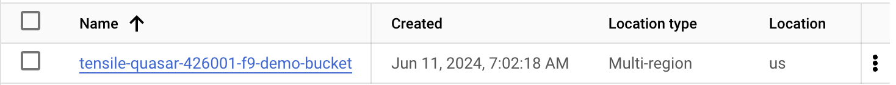

# Terraform

## `main.tf`

### Google Cloud Provider

- First block in `main.tf` is to create Terraform provider for Google Cloud.
- The **Google Cloud provider** is used to configure your Google Cloud infrastructure.
- You can google "Terraform provider for Google Cloud" to get the instruction [page](https://registry.terraform.io/providers/hashicorp/google/latest/docs)
  - Click "Use Provider" to copy the code into `main.tf` & update `project-id` and `region`

```json
terraform {
  required_providers {
    google = {
      source = "hashicorp/google"
      version = "5.32.0"
    }
  }
}

provider "google" {
  # Configuration options
  project     = "tensile-quasar-426001-f9"
  region      = "us-central1"
}
```

- With a configuration ready, you are now ready to create your infrastructure. There are a number of commands that must be followed:
  - `terraform fmt` (optional) formats your configuration files so that the format is consistent.
    - Note: this command can be run in the directory that contains `.tf` files to format them.
  - `terraform init` initialize your work directory by downloading the necessary providers/plugins and store in `.terraform` folder
    - `.terraform.lock.hcl` to capture the versions of all the Terraform providers you're using. Normally, you want to check this file into version control so that when your team members run Terraform, they get the exact same provider versions.

### Google Storage Bucket

- In this example, we will interact with Google Storage Bucket. You can google "Terraform Google Storage Bucket" to find the [docs](https://registry.terraform.io/providers/hashicorp/google/latest/docs/resources/storage_bucket) about this.
- `resource`: This keyword starts the resource block.
  - `"google_storage_bucket"`: This is the type of the resource.
    - In this case, google_storage_bucket referes to the Google Cloud Storage in GCP.
    - `aws_instance` refers to an EC2 instance in Amazon Web Services (AWS). Each resource type is associated with a specific provider (AWS in this case).
  - `"auto-expire"`: This is the name of the resource
    - It's an identifier you choose to refer to this resource within your Terraform configuration.
    - It **must be unique within the same module**. You can reference this resource elsewhere in your configuration using this name.
- `name` (Required) The name of the bucket. MUST BE globaly unique.
- `location` (Required) The GCS location.
- `age` the bucket will destroy after `age` day.

```Python
resource "google_storage_bucket" "auto-expire" {
  name          = "tensile-quasar-426001-f9-demo-bucket"
  location      = "US"
  force_destroy = true

  lifecycle_rule {
    condition {
      age = 3
    }
    action {
      type = "Delete"
    }
  }

  lifecycle_rule {
    condition {
      age = 1
    }
    action {
      type = "AbortIncompleteMultipartUpload"
    }
  }
}
```

- `terraform validate` (optional): returns a success message if the configuration is valid and no errors are apparent.
- `terraform plan` creates a preview of the changes to be applied against a remote state, allowing you to review the changes before applying them.
- `terraform apply` applies the changes to the infrastructure.
  - Type "yes" to deploy the change
  - This will create `terraform.tfstate` to store the current state.
- `terraform destroy` to check the state file and what changes need to be made to get rid of the resources.
  - The plan is returned providing have a list of resources to be destroyed and their details.
  - The `terraform.tfstate.backup` file is updated with the current state before the change.
  - The `terraform.tfstate` file is updated with the state after the change.

<p align="center"><br>The bucket "tensile-quasar-426001-f9-demo-bucket" has been created on GCP's Cloud Storage</p>

- `terraform destroy` removes your stack from the infrastructure.
