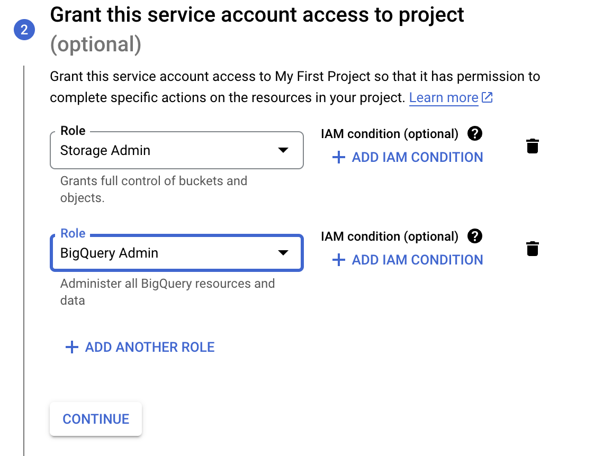

# Terraform

## Introduction

### What is Terraform ?

- [Terraform](https://www.terraform.io/) is an [infrastructure as code](https://www.wikiwand.com/en/Infrastructure_as_code) tool that allows us to provision infrastructure resources as code, thus making it possible to handle infrastructure as an additional software component and take advantage of tools such as version control. It also allows us to bypass the cloud vendor GUIs.
- [Providers](https://registry.terraform.io/browse/providers): code that allows Terraform to communicate to manage resources on
  - AWS
  - Azure
  - GCP
  - Kubernetes
  - Alibaba Cloud

### Why Terraform

- Simplicity in keep track of infrastructure
- Easier collaboration
- Re-producibility
- Ensure resources are removed

### Key Terraform Commands

- `Init` to get the providers I need
- `Plan` what am I about to do
- `Apply` do what is in the tf files
- `Destroy` remove everything defined in the tf files

## Initial Setup

### Terraform (local machine) to GCP via Service Account

#### Service Account

1. Setup a service account for this project and download the JSON authentication key files.

   1. _IAM & Admin_ > _Service accounts_ > _Create service account_
   2. Provide a service account name. We will use `dtc-de-user`. Leave all other fields with the default values. Click on _Create and continue_.
   3. Grant this **service account access to project**: below example is to grant the service account with _Storage Admin_ & _BigQuery Admin_ role
   

   4. There is no need to **grant users access** to this service account at the moment. Click on _Done_.
   5. With the service account created, click on the 3 dots below _Actions_ and select _Manage keys_.
   6. _Add key_ > _Create new key_. Select _JSON_ and click _Create_. The files will be downloaded to your computer. Save them to a folder and write down the path.

- :star: Note: This service account `.json` key has to be kept safely as other people can use that for using your account to doing their own stuffs, and it will be billed to your account
